# Event Booking App

A desktop event booking system built with JavaFX and SQLite. Users can browse events, manage a cart, and complete bookings. Admins can manage the event catalogue and export order reports.

---

## Features

**User**
- Register and log in securely (Caesar cipher password encryption)
- Browse events grouped by title in a tree view
- Add events to a shopping cart with quantity selection
- Edit quantities and remove items inline
- Checkout with a 6-digit confirmation code and day validation
- View full order history (most recent first)
- Export personal order history to CSV
- Change password

**Admin**
- Add, update, and disable/enable events
- View all orders across all users
- Export all orders to CSV with user ID

---

## Tech Stack

| Layer | Technology |
|---|---|
| UI | JavaFX 21 + FXML |
| Database | SQLite via JDBC (`sqlite-jdbc 3.45`) |
| Architecture | MVC + DAO pattern |
| Testing | JUnit 5 |
| Build | Maven |

---

## Project Structure

```
src/main/java/
├── controller/         # JavaFX controllers (one per screen)
│   ├── LoginController
│   ├── SignupController
│   ├── HomeController
│   ├── CartController
│   ├── OrderController
│   ├── AdminController
│   ├── AdminOrderController
│   ├── AddEventController
│   ├── UpdateEventController
│   ├── EventViewController
│   └── ChangePasswordController
├── dao/                # Data access layer
│   ├── EventDao / EventDaoImpl
│   ├── OrderDao / OrderDaoImpl
│   ├── CartDao  / CartDaoImpl
│   ├── UserDao  / UserDaoImpl
│   ├── Database        # SQLite connection singleton
│   └── PasswordEncryption
├── model/              # Domain objects + application state
│   ├── Event / EventGroup
│   ├── Order
│   ├── Cart / CartItem
│   ├── User
│   └── Model           # Central model (DAO registry)
├── Test/
│   └── Validation      # Input validation utility (static methods)
└── Main.java           # Application entry point

src/test/java/
└── ValidationTest.java # JUnit 5 test suite for Validation
```

---

## Getting Started

### Prerequisites
- JDK 21
- Maven 3.8+

### Run

```bash
mvn javafx:run
```

### Test

```bash
mvn test
```

---

## Key Design Decisions

- **DAO pattern** — all database access goes through interfaces (`EventDao`, `OrderDao`, etc.), making the persistence layer swappable and testable independently of the UI.
- **Cart singleton** — `Cart.getInstance()` maintains in-memory cart state across screens. Every UI mutation (add, remove, quantity edit) is mirrored to the singleton to keep state consistent.
- **Transactional checkout** — seat decrements across multiple events are wrapped in a single JDBC transaction with rollback on failure, preventing partial bookings.
- **Validation utility** — all input rules (price, capacity, confirmation code format, event day window) live in a single `Validation` class covered by JUnit tests, shared by all controllers.

---

## Default Credentials

| Role | Username | Password |
|---|---|---|
| Admin | `admin` | `Admin321` |
| User | Register via the signup screen | — |

---

## Screenshots

Login & Sign Up

<p float="left">
  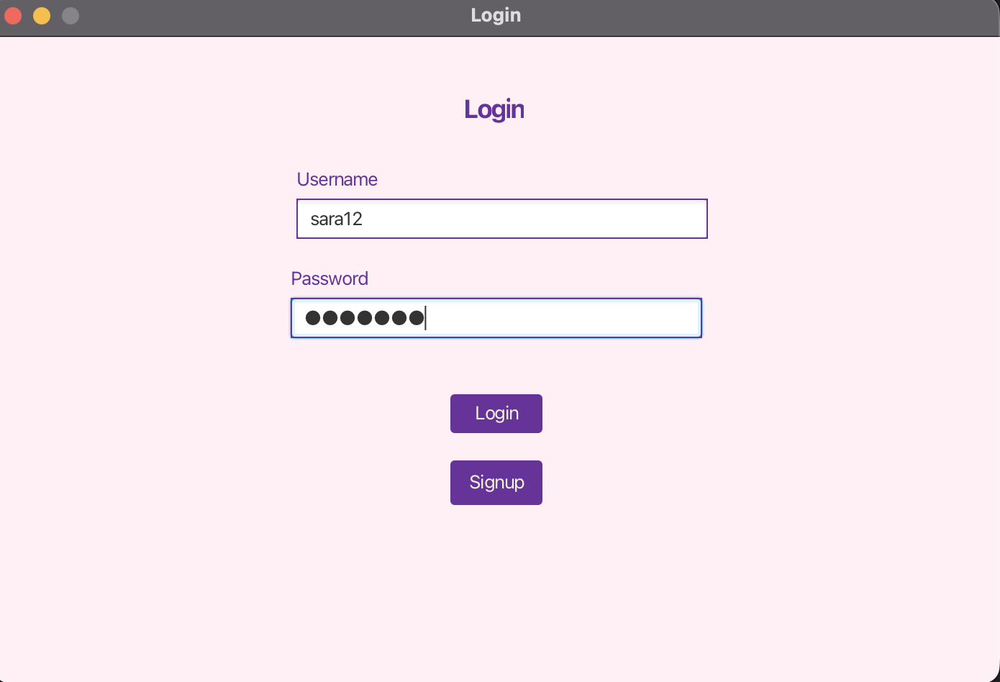
  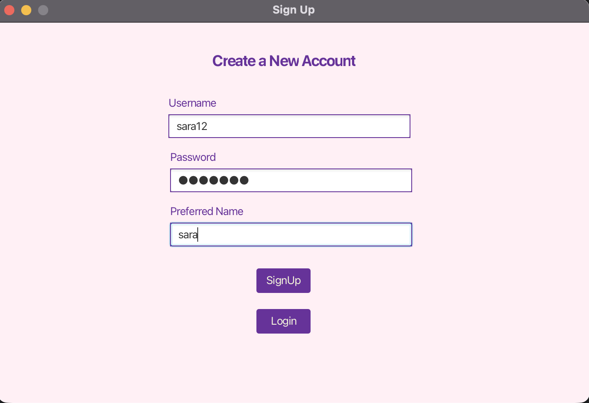
</p>
Dashboard & Event Details

<p float="left">
  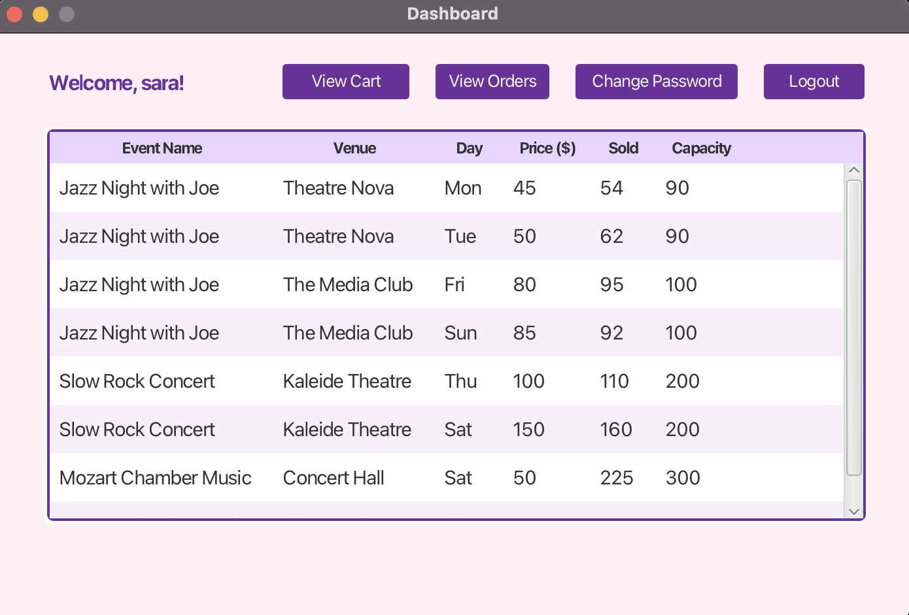
  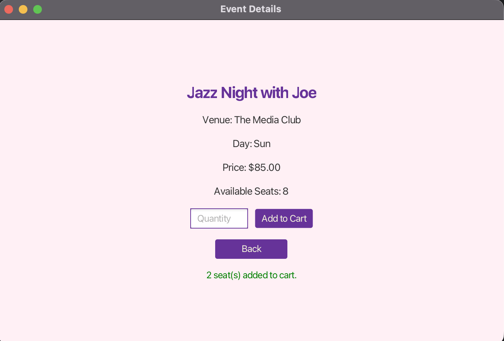
</p>
Shopping Cart & Checkout

<p float="left">
  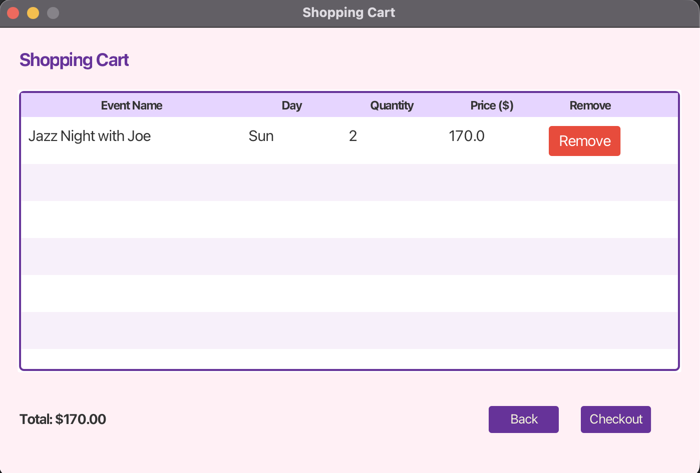
  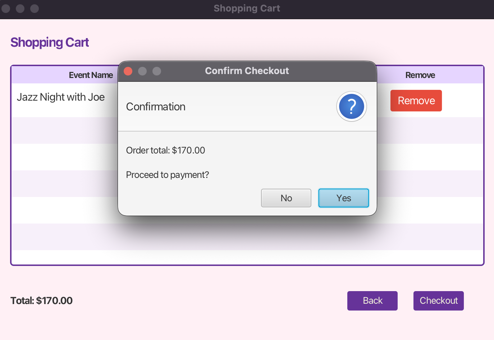
</p>
<p float="left">
  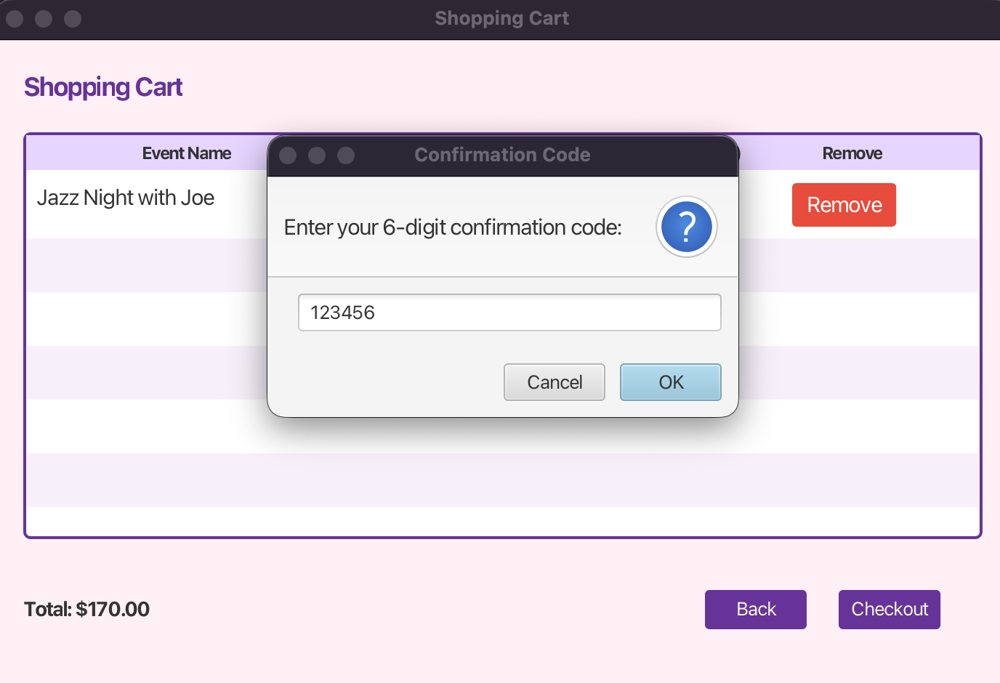
  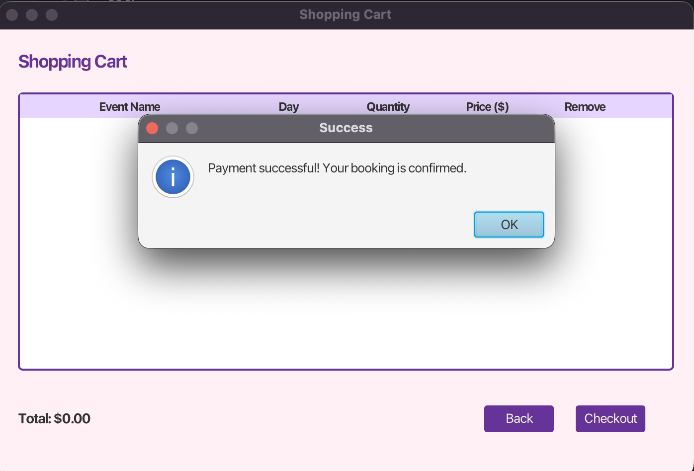
</p>
Order History & Export

<p float="left">
  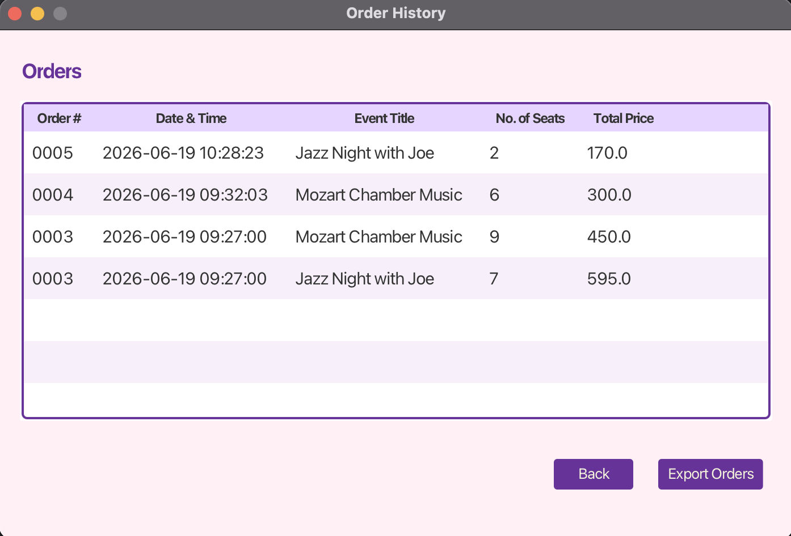
  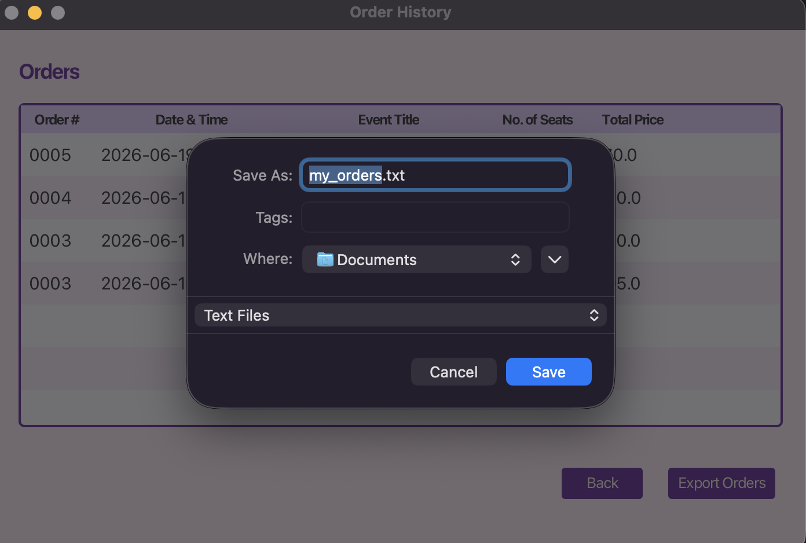
</p>
Change Password

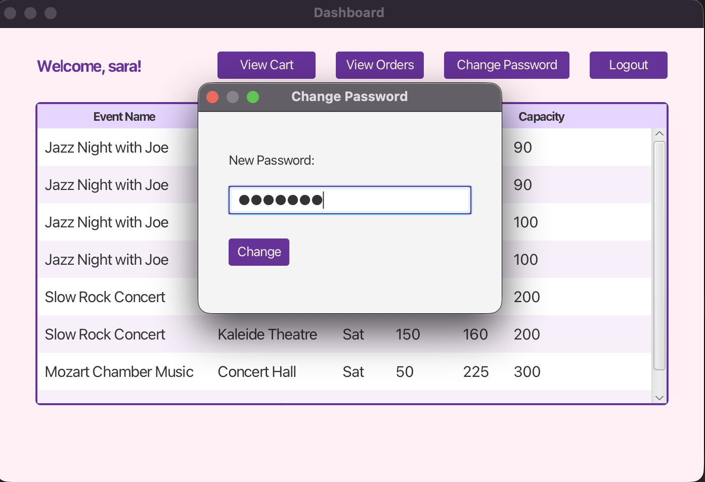
